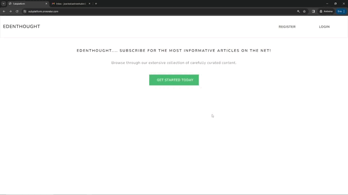
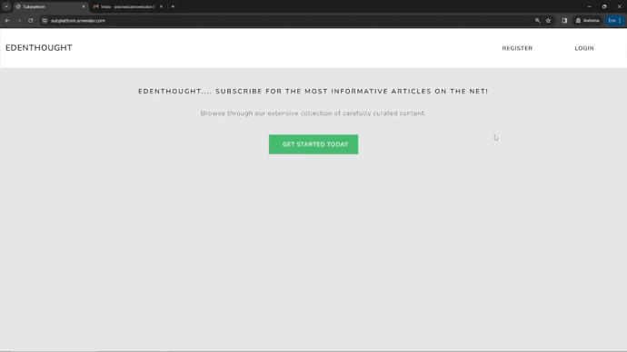

# Edenthought | Subplatform

Subplatform, também conhecida como Edenthought, é uma plataforma de artigos com assinaturas feita em Django, como um projeto Full Stack. Esta aplicação foi desenvolvida inspirada no projeto do curso "Python Django: Build a Subscription Platform - 2024", criado por Arno.

- Deploy no Render: [Edenthought | Subplatform](https://subplatform.onrender.com)

## Destaques

- Modelo de usuário personalizado
- Criação e autenticação de usuários
- Interface base de navegação e layout
- Gerenciamento de CRUD para artigos
- Gerenciamento de contas
- Integração com API SandBox de pagamentos do PayPal 
- Pagamentos com cartão ou saldo no PayPal SandBox
- Criar, excluir e atualizar uma assinatura
- Gerenciamento de senha
- Verificação de e-mail


## Observações

- O projeto foi fortemente inspirado ao do curso, porém foram feitas alterações para tornar o código escalavel.
- Vale ressaltar que os pagamentos não são reais! É apenas para um ambiente de desenvolvimento e aprendizado.
- Para rodar o projeto é preciso criar um app no ambiente de desenvolvimento do PayPal e fazer as devidas configurações no arquivo ".env"!


## Demonstração





## Rodando localmente

### Clone o projeto

```bash
  git clone https://github.com/joaoleau/subplatform.git
```

### Entre no diretório do projeto

```bash
  cd subplatform
```

### Ambiente Virtual Python

```bash
  python -m venv venv
```

### Ative o ambiente virtual
- No Windows:
```bash
  venv\Scripts\activate
```

- No Unix ou MacOS:
```bash
  source venv/bin/activate
```

### Instale as dependências

```bash
  pip install -r requirements.txt
```

### Configure as variaveis de ambiente
Faça os devidos ajustes no arquivo ".env-example" e depois altere seu nome para ".env"

### Faça as migrações

```bash
  python .manage.py makemigrations
```

```bash
  python .manage.py migrate
```

### Inicie o projeto

```bash
  python .manage.py runserver
```


## Aprendizados

Com a elaboração deste projeto, além de fortalecer meus conhecimentos em Python e Django, pude aprender a integrar minha aplicação com a API Rest do PayPal para pagamentos. Diferente de outros projetos próprios, decidi mudar e encarei uma aplicação Full Stack, explorando ainda mais o que o Django é capaz de proporcionar.

Este projeto foi realizado em conjunto com o curso já citado, porém ainda foram feitas alterações de minha autoria, como a adaptação para o uso de Class-Based-Views.

## Links

- GitHub: [@joaoleau](https://www.github.com/joaoleau)
- Linkedin: [Joao Vitor Leal](https://www.linkedin.com/in/joaolealc/)

## 🛠 Ferramentas
Python, Django, API Rest, Javascript, HTML, Bootsrap, CSS e Git

